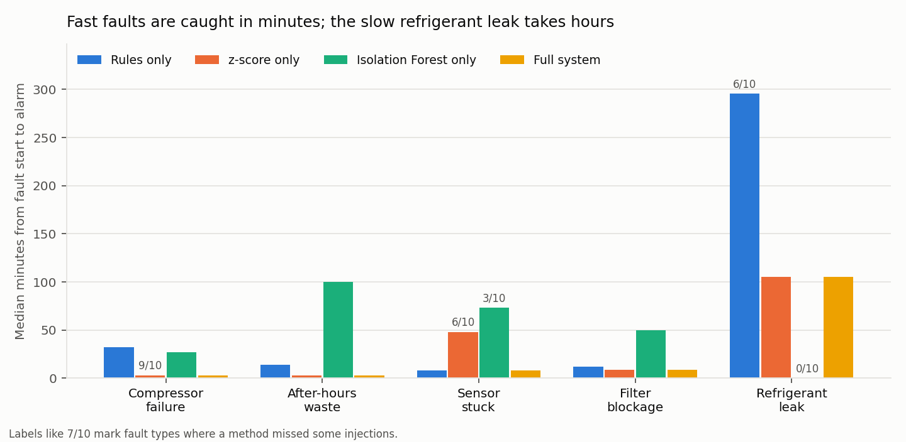
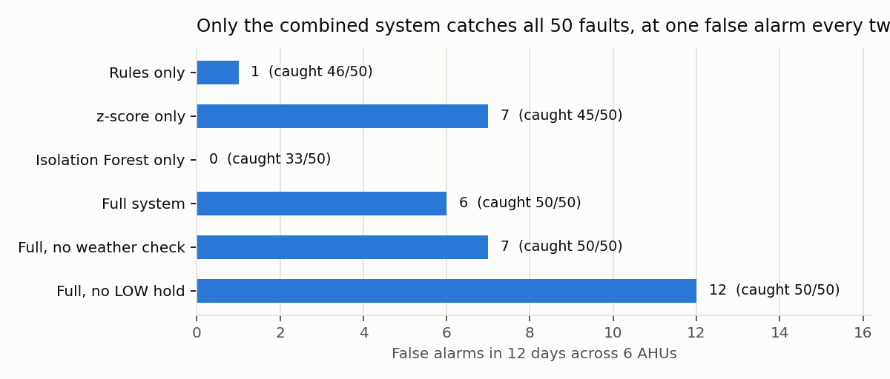

# Report sections: data, detection and dashboard (Person 1 draft)

Draft text for the final report. Figures are in `evaluation/results/`; numbers come
from `evaluation/results/results.md` and can be regenerated with
`python evaluation/evaluate_detection.py`.

---

## 3.1 Simulated building and HVAC units

Real HVAC fault data with ground-truth labels is rarely available, so the system is
developed and evaluated on a physics-based simulator. The simulated building has six
zones, each served by one air handling unit (AHU-1 to AHU-6). Every simulated minute,
each AHU publishes one telemetry message over MQTT (topic `hvac/{device_id}/telemetry`).

**Zone heat balance.** The room temperature T_zone follows a lumped heat balance:

    C · dT_zone/dt = Q_gain − Q_cool
    Q_gain = UA · (T_out − T_zone) + 0.08 kW · occupants + equipment + solar
    Q_cool = 0.00057 · airflow_cfm · (T_zone − T_supply)

The cooling term is the standard sensible-heat equation (1.08 · CFM · ΔT in BTU/h,
converted to kW and °C). Supply air is return air mixed with 10% outdoor air, cooled by
the coil in proportion to the compressor load. A PI controller sets the compressor load
so that the measured room temperature tracks the setpoint.

| Parameter | Value |
| --- | --- |
| Units / zones | 6 |
| Setpoints | 22.5 to 24.0 °C |
| Airflow at 75% fan speed (clean filter) | about 2,250 CFM |
| Fan / compressor rated power | 1.8 kW / 7.5 kW |
| Thermal capacitance | 3.0 kWh/°C (air, furniture and slab) |
| Schedule | units on 07:00 to 18:30; occupied 08:00 to 18:00 |
| Outdoor temperature | hot-climate daily cycle, about 27 °C at 05:00 to 38 °C at 15:00, ±2 °C from day to day |
| Sensor noise | room 0.08 °C, supply 0.15 °C, airflow 25 CFM, power 0.06 kW |

On a normal day the controller holds every zone within ±0.5 °C of its setpoint during
occupied hours, and each unit uses about 61 to 67 kWh.

## 3.2 Fault models

Faults change the physics or the sensor, never the labels. Detection therefore has to
find them from their effects, as it would in a real building.

| Fault | Model | Observable effect |
| --- | --- | --- |
| Filter blockage | filter factor ramps from 1.0 to 0.6 over 20 min | airflow −40%; the controller compensates, so compressor power **rises** (≈ +2 kW) and supply air gets colder; room temperature mostly holds |
| Compressor failure | cooling capacity drops to zero at once | power collapses to fan only (≈ 0.8 kW); supply air reaches room temperature; room warms ≈ 3 °C in the first hour |
| Refrigerant leak | capacity fades to 50% over 3 h | compressor gradually saturates; power creeps up; room drifts warm in the afternoon |
| Sensor stuck | room sensor repeats its last value | reading frozen while the real room drifts; control degrades |
| After-hours waste | unit forced on at 100% fan after 18:30 | ≈ 3,000 CFM and 3 to 6 kW with nobody in the building |

The filter blockage illustrates why single-threshold monitoring is not enough: the
room stays comfortable, so a temperature alarm never fires, yet energy is being wasted.

## 3.3 Datasets and evaluation protocol

| Set | Days | Faults | Used for |
| --- | --- | --- | --- |
| Training | 14 normal days | none | learning normal behaviour (baseline, Isolation Forest) |
| Validation | 5 days | 20 (4 of each) | choosing thresholds and design options |
| Test | 12 days (10 with faults, 2 normal) | 50 (10 of each) | final results, evaluated once |

Each fault day injects all five faults on five different AHUs at random times within
realistic windows, so one unit stays healthy each day. All sets use different random
seeds. An earlier test set was inspected during development; to avoid optimistic
results, the final test set was regenerated with a new seed and evaluated only once,
after all design choices were frozen on the validation set.

**Metrics.** A fault counts as *detected* if an anomaly event fires on the same AHU
between the fault start and 15 min after it ends; *time to detect* is the delay from
fault start. An event outside every fault (plus 60 min of recovery) is a *false alarm*.
Reading-level precision, recall and F1 are reported as a secondary measure.

## 4.1 Monitoring agent (rules)

Fast, explainable rules with short persistence windows, so a single noisy reading never fires:

| Rule | Condition |
| --- | --- |
| Room too warm | occupied, unit on, room > setpoint + 1.5 °C for 5 min |
| Temperature rising fast | unit on, room +1.0 °C within 10 min |
| Low airflow | airflow per % fan speed < 80% of the unit's normal for 3 min |
| Sensor reading frozen | room temperature identical for 10 readings |
| Running with nobody in | unit on outside the schedule with zero occupancy for 15 min |
| Unit stopped reporting | no message for 30 s (real time) |

## 4.2 Anomaly Detection agent

**Time-of-day baseline and z-score.** Normal HVAC behaviour changes through the day
(night, start-up, office hours, hot afternoons). For every AHU and every 15-minute slot
of the day, the mean and standard deviation of each signal are learned from normal data.
A reading's deviation is z = (value − mean) / std, computed on a 3-minute rolling mean.
Each signal has its own threshold (99.9th percentile of |z| on training data, never below 3σ).

**Isolation Forest.** An unsupervised model (200 trees) trained on normal data only,
over nine features: the seven z-scores, the 10-minute temperature slope and the
log of the 10-minute temperature variability. It flags unusual *combinations*, for
example normal temperature with unusually high power. Its threshold is the 99.99th
percentile of training scores.

**Physically informed context.** Three design choices, each chosen on the validation set:

1. *Unit off or starting up.* While a unit is off, the room simply drifts with the weather;
   during the first 80 min after switch-on it is being pulled down from that weather-dependent
   temperature. Room-side signals are not judged in these periods, only power and airflow
   (is the unit really off, is it running normally?).
2. *Controller outputs.* Supply-air temperature and coil temperature drop are controller outputs
   that swing whenever occupancy changes. They are given to the Isolation Forest (in combination
   with power and airflow) but not judged alone by the z-score.
3. *Building-wide check.* If three or more other units were also abnormal one minute earlier,
   the whole building is reacting to weather, not this unit failing; the deviation is ignored.

**From readings to events.** A reading is *suspicious* if either score passes its threshold.
An event is raised when 4 of the last 5 readings are suspicious or a rule fires. LOW-severity
events must persist for 20 min (this removes short blips while people arrive); MEDIUM and
HIGH are raised at once. Each event (contract: `contracts/anomaly_event.schema.json`) lists the
five most deviating sensors with their normal values, the rules that fired and the last 30
readings, which the Diagnosis agent uses as context.

## 4.3 Triage step: the agentic part of the Anomaly Detection agent

The detectors say *that* a unit is abnormal. Before the Supervisor spends effort on it, an LLM
triage step decides *what kind* of problem it is and whether it is real
(`backend/app/detection/triage.py`). It does not name a root cause or a repair; those belong
to the Diagnosis and Maintenance agents.

**Tools, chosen by the LLM.** The agent receives the event and decides which checks to run,
calling plain Python tools (`triage_tools.py`) through OpenAI function calling:

| Tool | What it returns |
| --- | --- |
| `signal_deviations` | sensors furthest from this unit's normal value, rules that fired |
| `recent_trend` | how each sensor moved over the last 5-60 min, airflow per % fan speed |
| `sensor_health` | frozen, out-of-range or missing sensors |
| `other_units` | whether other units are abnormal at the same time (building-wide cause) |
| `schedule_context` | time vs operating schedule, occupancy, unit status |
| `device_history` | earlier anomalies on the same unit |

When it has enough evidence it calls `submit_triage` with a verdict (equipment fault, sensor
fault, operational waste, building-wide, false alarm, unclear), the suspected area (airflow,
cooling, sensor, schedule), a confidence, 2-4 pieces of evidence with numbers, and a routing hint
for the Supervisor (Diagnosis, Energy, Maintenance or human review). The answer is validated
against a Pydantic schema.

**Robustness.** An invalid answer is sent back once with the validation error. A timeout,
network error, missing API key, a second invalid answer or more than six rounds switches to a
deterministic rules triage that uses the same tools in a fixed order. The rules verdict is also
stored next to every LLM verdict, so disagreements are visible on the dashboard and in the
trace. Triage runs in a background thread: the incident appears at once and the triage is added
seconds later, so ingestion is never slowed down. Every LLM call, tool call, retry and fallback
is recorded as an execution-trace line (`GET /incidents/{id}/trace`).

**Results (rules triage).** Ground truth is the area of the injected fault (filter → airflow,
compressor and refrigerant → cooling, stuck sensor → sensor, after-hours → schedule). The rules
were tuned on the validation set (20/20 correct after adding "more power at normal airflow →
cooling" for early refrigerant leaks), then run once on the test set:

| Test set (57 detector events) | Result |
| --- | --- |
| Real-fault events with the correct area | 50/51 (98%) |
| Real faults wrongly dismissed | 1 (compressor failure while 3 other units were abnormal → "building-wide") |
| False alarms recognised as false alarm / building-wide | 0/6 |

All six false alarms occur between 08:00 and 09:15 during the morning warm-up; the fixed rules
cannot tell them from real faults. The LLM triage is evaluated on the same events with
`python evaluation/evaluate_triage.py --split test --provider openai`; the results are added here after that run.

## 4.4 Robustness: input validation and fault injection

**Input validation.** Every MQTT message is checked before it is stored or analysed
(`backend/app/ingestion/validation.py`): valid JSON, a known device id format, a readable
timestamp, ON/OFF status, every required value present, numeric and finite, and inside
physically possible limits (e.g. room temperature -10 to 60 °C, humidity 0-100 %, power >= 0).
A broken message is rejected with a reason, counted and listed on the dashboard; the system
keeps running. The limits were checked against all 276,480 readings of the four datasets: none
of them was rejected, so the validation never discards real data (including all fault periods).

**Controlled fault injection.** The dashboard's Simulator page sends commands through the API
to the simulator over MQTT. Commands are validated twice: by the API (a Pydantic model: allowed
actions, unit ids, fault names, time format, numeric ranges; anything else returns HTTP 422 before
it is sent) and by the simulator (a fixed list of allowed commands; no shutdown, no file paths).
The "send a broken reading" buttons (impossible value, missing value, not JSON, negative power)
demonstrate the validation live. A unit taken offline raises a `device_offline` event within
30 s, which the triage agent classifies as a maintenance case.

## 5.1 Results

Test set, 12 days × 6 AHUs, 50 injected faults:

| Configuration | Faults detected | Median time to detect | False alarms | Event precision | Reading-level F1 |
| --- | --- | --- | --- | --- | --- |
| Rules only | 46/50 | 14 min | 1 | 98% | 0.72 |
| z-score only | 45/50 | 9 min | 7 | 88% | 0.77 |
| Isolation Forest only | 33/50 | 50 min | 0 | 100% | 0.50 |
| **Full system** | **50/50** | **8 min** | **6** | **89%** | **0.80** |
| Full, no building-wide check | 50/50 | 8 min | 7 | 88% | 0.80 |
| Full, no 20-min hold on LOW | 50/50 | 8 min | 12 | 81% | 0.80 |

Full system per fault type:

| Fault | Detected | Median time to detect | Slowest |
| --- | --- | --- | --- |
| Compressor failure | 10/10 | 3 min | 26 min |
| After-hours waste | 10/10 | 3 min | 3 min |
| Sensor stuck | 10/10 | 8 min | 8 min |
| Filter blockage | 10/10 | 9 min | 12 min |
| Refrigerant leak | 10/10 | 106 min | 282 min |

## 5.2 Discussion

- **The methods complement each other.** Each method alone misses faults the others catch:
  the rules miss four slow refrigerant leaks (no single threshold is crossed), the z-score misses
  four of ten stuck sensors (a frozen value close to normal is not "far" from normal) and one
  compressor failure, and the Isolation Forest misses every refrigerant leak and seven stuck sensors. Combined, the system
  detects all 50.
- **Fast faults are caught in minutes; slow faults take hours.** Abrupt faults (compressor,
  after-hours) are caught in about 3 min, filter blockage in about 9. A refrigerant leak develops
  over hours and the controller hides it at first by working harder, so it is caught after a median
  of 1.8 h. This is still well before occupants would notice a warm room, but faster leak detection
  would need trend features over several hours (future work).
- **False alarms.** Six in 12 days (one every two days for the whole building). All six occur
  between 08:04 and 09:13, while people arrive and occupancy changes quickly. The 20-minute hold on
  LOW events halves false alarms (12 to 6) at the cost of a few minutes on slow leaks; the
  building-wide check removes weather-driven alarms.
- **Isolation Forest alone is precise but slow.** It produces no false alarms but detects late,
  because its threshold must be strict to stay quiet during normal transitions. Its value is in
  combination, where it adds evidence from unusual combinations of signals.
- **Live equals evaluated.** The live pipeline is verified (automated test) to produce exactly
  the same events as the batch evaluation, so the reported numbers describe the demo system.

## 5.3 Limitations and future work

- Results come from simulated data. Real sensors drift, drop messages and are noisier; the
  thresholds would need re-calibration on a few weeks of real normal data.
- One fault per unit at a time; combined faults are not modelled.
- Weather enters only through outdoor temperature; humidity-driven loads are not modelled.
- Next steps: multi-hour trend features for slow faults, outdoor temperature as a baseline input
  instead of the building-wide check, and connecting real devices through an IoT platform such as
  ThingsBoard (the data side only needs a new input adapter).

## 6. Dashboard

The dashboard is a React application built for a facility manager, not a developer. It
opens on a floor plan of the building: each zone shows its live temperature, airflow,
power and occupancy, and turns red when a fault is being handled. Clicking a zone opens
its sensor history. The incident page shows, top to bottom, the decision the operator
has to make (Approve and create ticket, or Reject with a reason), what the sensors show
compared with normal, the likely cause with evidence, the recommended action, the cost
of waiting, and a timeline of how each agent handled the case. A switch in the top bar
changes the reasoning model (OpenAI, local Ollama, or rules only) while the system runs.
Without a backend it runs on the agreed example responses, so the interface could be
built in parallel with the agents.

**Design choices.** A light, high-contrast theme (projectors wash out dark themes);
red is reserved for faults; numbers use a condensed typeface for legibility at a
distance; every colour is paired with a text label so it remains readable for
colour-blind viewers; all times are shown in building time.
